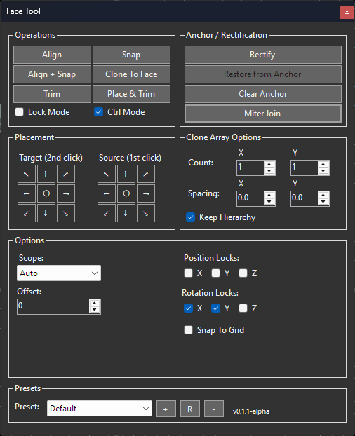

# HammerTime Face Tool

> [!IMPORTANT]
> **Alpha & Format Notice**
> *Developed using AI with the active participation of the repository owner.*
> 
> This plugin is currently in an Alpha state. As HammerTime and other editors (like J.A.C.K.) evolve, there is a minor theoretical risk of format deviations. To ensure maximum safety for your primary work, keep in mind that subtle incompatibilities *could* occur.

A plugin for the **HammerTime** level editor designed for quick and precise alignment, snapping, cloning, and trimming of geometric objects (brushes/solids, groups, and entities) relative to the planes of selected faces.

## Workflow

Instead of blocking the editor, the plugin works as an on-demand operation helper:
1. **Activate Mode**: Click any operation button (e.g., *Align*, *Trim*) in the Face Tool window. This temporarily activates the **Face Tool** in the editor.
2. **Select Faces**: Click the required face(s) in the 3D viewport:
   * 1-click operations (Snap, Rectify, Trim) execute on the clicked target face using the editor's active selection.
   * 2-click operations (Align, Align + Snap, Place & Trim, Miter Join, etc.) require selecting a **Source** face first, then a **Target** face (note that standalone **Snap** is a 1-click operation).
3. **Execute & Revert**: Once the faces are chosen (and CTRL is held if *Ctrl Mode* is active), the transformation is applied, and the editor automatically switches back to the standard **Selection Tool**.
4. **Lock Mode**: If *Lock Mode* is checked, the operation mode remains active for a series of actions, otherwise it resets to default selection.

---

## Key Features

* **Align** — Rotates the source object so that the normal of the selected source face matches the opposite normal of the target face.
* **Snap** — Moves the object in space so that it touches the target face without penetration (uses closest-vertex snapping logic).
* **Align + Snap** — Combined atomic operation of alignment and snapping.
* **Clone to Face** — Clones the source object and aligns/snaps the clone to the target face.
* **Trim** — Cuts/trims the selected solids in the editor using the plane of the target face (1-click operation).
* **Place & Trim** — Aligns, snaps, and trims the object against the target face in a single atomic action.
* **Miter Join** — Seamlessly joins two intersecting solids (like pipes, walls, or vents) at any arbitrary angle by performing a diagonal cut along their bisector plane (2-click operation).
* **Restore** — Restores the object to its original position using the system of control points (Anchors).

---

## Usage Notes

* **SelectTool Integration:** When the Face Tool window is open, the editor's default **Selection Tool** remains active by default. You can freely select, move, and edit brushes or groups. Only when you click an operation button (like *Align* or *Snap*) does the active editor tool switch to **Face Tool** to let you pick faces in the 3D viewport. Once the operation completes (or if you toggle the mode off), the active tool automatically reverts to **Selection Tool**.
* **Ctrl Mode** — When checked (default), you must hold the **CTRL** key to execute operations on click. For 2-click operations, clicking without CTRL updates the first selected face (Source), allowing you to re-select it. If unchecked, the operation executes immediately on click without requiring CTRL.
* **Multi-Object Operations (Snap & Trim):** Multi-object snapping, trimming, and hierarchical filtering apply to **Snap** and **Trim** operations. Operations involving rotation (like Align, Align + Snap, and Clone) are face-to-face (side-to-side) actions and transform only the single object hierarchy resolved from the clicked face.
* **Preserving Relative Offsets (Snap only):** When performing a **Snap** on multiple selected objects simultaneously, the tool computes a single translation matrix based on the closest vertex among all selected objects combined, moving the entire selection as a single unit and preserving their relative positions.
* **Shift Modifiers (Snap, Trim & Miter):** Holding the **SHIFT** key during operations alters the default behavior:
  - **Snap (Experimental):** Instead of snapping the *closest* vertex, it attempts to snap the *furthest* vertex of the selected geometry to the plane, placing the object on the opposite side of the target face. *Note: Since grid locks/axis locks can override this translation, this mode is currently experimental and may require testing on complex geometry.*
  - **Trim, Place & Trim & Miter Join (Experimental):** Inverts the cutting direction, allowing you to slice and keep the opposite side of the geometry instantly. *Note: For Miter Join (bisector split), the side calculation has been updated to use face normal projections, but complex intersections may still experience clipping artifacts under certain angles.*
* **Hierarchical Filtering (Snap & Trim):** Nested selections (e.g., both a parent group and its child solids) are filtered automatically during **Snap** and **Trim** to prevent double-transformation or double-clipping of child elements.

---

## Mathematics and Logic

### 1. Rotation Locks
To provide precise control over object orientation, rotation locks are available:
* **Free Rotation (all locks unchecked)**: The object is rotated along the shortest 3D arc. Normals align perfectly, but the object can tilt sideways (roll) relative to the horizon.
* **Partial Locks (1 lock checked)**: Rotation uses swing-twist decomposition relative to the locked axis. The rotation component around the locked axis is discarded (zeroed out), and the remaining swing or twist component is reconstructed, preventing any rotation along that specific axis.
* **Single Axis Restrictions (2 locks checked)**: When rotation is allowed around only one axis (e.g. X and Y are locked, allowing only Z/Yaw), vectors are projected directly onto the 2D plane perpendicular to the free axis. This is mathematically robust and avoids gimbal lock, keeping the object strictly upright.

### 2. Closest-Vertex Snapping
Instead of centroid-based snapping, which causes brushes to sink into walls or hover in mid-air on slanted surfaces:
* The algorithm calculates the signed distance of all vertices of the source face to the target plane.
* It selects the vertex with the minimum signed distance (the one that would penetrate furthest into the plane).
* The object is shifted by this distance (plus user-defined offset). The geometry touches the target plane at its closest point without clipping through.

---

## Selection Scope

The tool supports different levels of object hierarchy via the **Scope** selector:
* **Auto** — Automatically resolves the clicked solid to its top-level parent (Group or Entity).
* **Brush** — Only transforms the specific clicked brush (Solid).
* **Group** — Transforms the entire group that contains the clicked brush.
* **Entity** — Transforms the entire entity object containing the clicked brush.

---

## Settings Persistence

UI configurations and window coordinates are automatically saved when the tool window is hidden or when the editor is closed.
* Settings are stored at: `%APPDATA%\Hammertime\FaceToolSettings.json`.
* Serialization uses the native **`System.Text.Json`** library without external dependencies.
* Multi-monitor configurations (including negative screen coordinates for left-side monitors) are supported.

---

## TODO / Future Improvements

* Move options like *Ctrl Mode*, and custom snap behaviors (such as Alternative Snap or Brush-to-Side snap vectors) to the editor's global tool settings (`ISettingsContainer`) to clean up the dialog UI and prevent rigid UX assumptions.

---

## Recent Updates

* **Miter Join (Bisector Split)**: Introduced a new 2-click operation to cleanly join intersecting solids (pipes, vents, walls) at any arbitrary angle. The clipping plane location is mathematically computed as the closest approach point between the projection axes of the two solids, ensuring the split plane sits exactly in the center of the intersection.
* **Profiles (Presets) System**: Added a preset management bar allowing users to save, delete, rename, and load Face Tool settings profiles (Scope, Offset, Locks, Anchors, and Clone options) to files at `%APPDATA%\Hammertime\FaceToolProfiles.json`.
* **Full Localization Support**: All user-facing UI labels, group titles, button text, and check boxes are now dynamically localized. They can be customized via the `%APPDATA%\Hammertime\Translations\HammerTime.FaceTool.en.json` file.
* **Trim and Place & Trim Improvements**: Rewrote clipping operations to support hierarchical groups/entities and added a fallback transformation mechanism when a solid is coplanar with the cut plane, avoiding false warning dialogs.
* **Local Hotkey Registration & Global Settings**: Integrated Face Tool settings into the editor's global settings under `Tools/Plugins/Face Tool`. Added configurable local hotkeys (defaulting to 1-7) to switch tool operations.
* **Selection Tool Integration**: The Face Tool window no longer blocks map interactions. By default, the editor's standard selection tool remains active. The Face Tool activates temporarily only when a specific operation is triggered, and automatically reverts to selection on completion.

---

## Requirements

* Target Framework: **.NET 6.0-windows**
* Host Application: **HammerTime** level editor
